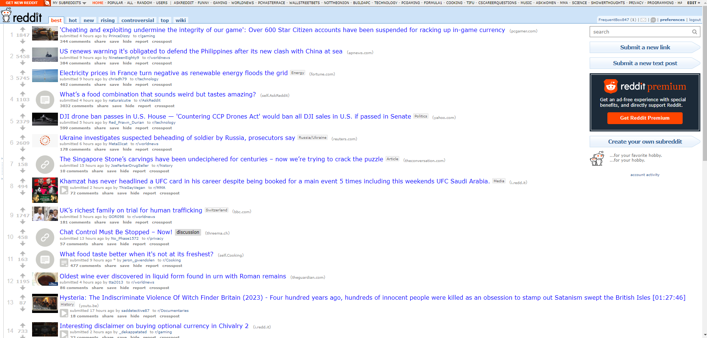

# reddit-clone
A simple (Old) Reddit clone built with React, Express, and Firebase (auth + Firestore)

## Background
I've always preferred the aesthetic and functionality of Old Reddit over the 2018 redesign. What I appreciate most is its efficient use of screen real estate. In Old Reddit, each post is allocated its own compact row, allowing users to view approximately 15 post titles (on desktop, at least) simultaneously. This layout facilitated a quick and comprehensive overview of content, minimizing the need for excessive scrolling. In contrast, the redesign emphasizes prolonged scrolling -- not unlike virtually every other social media app today -- and displays more content from individual posts (including everyone's favorite sponsored/promoted content) than I find necessary.

How it was:


Hows it's going:


I felt like recreating the Old Reddit aesthetic was complex enough to be gratifying while simple enough so as not to draw away from the main purpose of this exercise: to design and build a full-stack application with React in the front, and Express + Firebase in the back.

## Features
* User authentication
* Create, read, update, and delete(TODO) posts
* Comment on posts
* TODO:Upvote and downvote posts
* TODO: Upvote and downvote comments
* TODO: Edit and delete comments
* TODO: View user profiles


## Technologies
* TypeScript
* Vite
* React
* Express
* Firebase (auth + Firestore)
* Good ol' CSS

## Learnings
* Designing component interactions by the seat of your pants / "drawing from reference" isn't a great approach -- diagramming the data sources and which individual props would be needed by each component would've saved a lot of refactoring for incremental changes to the data model (i.e., better to build complete interfaces/types upfront than add fields/properties piecemeal as needed). 
* Firebase is criminally easy to set up, but Firestore reads can quickly get out of hand if you're not careful with your queries and/or you have multiple tabs of the Firestore Console open


## Setup
1. Clone the repository
2. Install dependencies
```bash
npm install
```
3. Create a Firebase project and enable Firestore and email/password authentication
4. Create a firebase-config.ts file in the root directory with the following content (refer to [Firebase Docs](https://firebase.google.com/docs/auth/web/start)):
```typescript
export const firebaseConfig = {
  apiKey
    authDomain
    projectId
    storageBucket
    messagingSenderId
    appId
}
```

5. Start the development server
```bash
npm run dev
```

