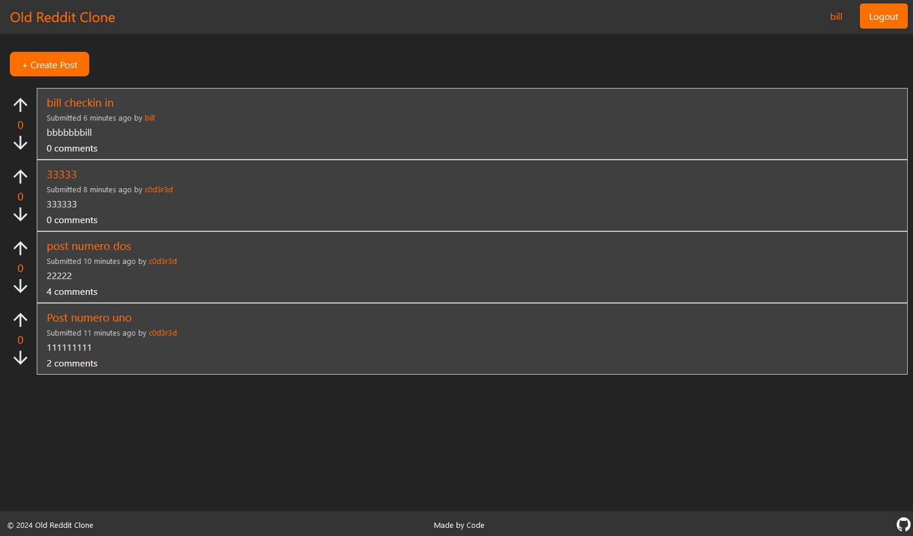
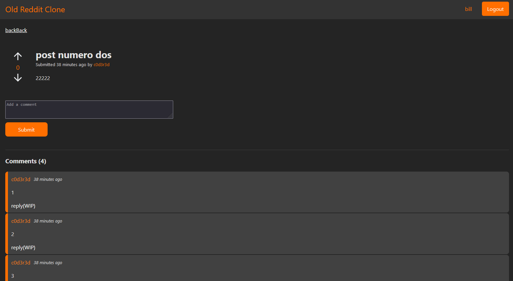
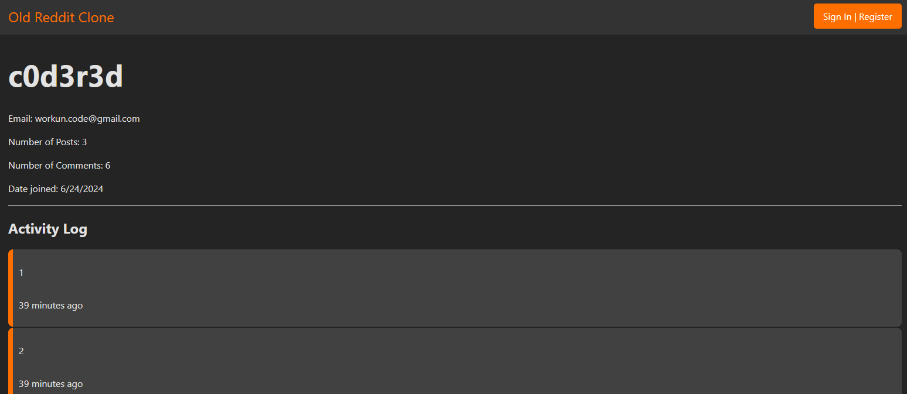

# Dev Log - Frontend

## July 2, 2024

Frontend deploy: https://d5ngvcz90y0bk.cloudfront.net

Wins:
* Hosted on AWS Cloudfront via S3 (HTTPS)
* CSS tweaks

Notes:
* Hosting a frontend is stupidly easy with S3 and Cloudfront -- hardly any troubleshooting or reconfig needed to get it to work. Unfortunately, the value of this app lies in its ability to communicate with the backend, which is currently hosted on HTTP. See the backend dev log for more info

## June 26, 2024 - CSS Hell

Wins:
- Beautified Login and PostListItem components
- Added a loading spinner
- Various CSS tweaks
- Started using CSS modules

Notes:
- The many stylesheets have caught up with me and highlighted the lack of organization in previous commits. I've been writing CSS under the mistaken assumption that any stylesheets imported directly into a component take precedence over other unimported stylesheets. In hindsight it seems obvious, but only apparent as I've begun to use conflicting classNames. I need to better review App.css to determine actually common rules and weed out the hacky CSS added earlier in the project.
- Further to above, heavy duplication between similar components needs to be addressed (PostListItem, PostPage, ActivityLog) 
- Semi-transparent panels,radial gradients, and blur effects are pleasant to look at and easy to implement with a few key rules:
```css
    /* Radial lighting inspired by NVIDIA GeForce Experience client  */
    background: radial-gradient(
        circle at top right,
        rgba(255, 255, 255, 0.2) 0%,
        rgba(255, 255, 255, 0) 70%
        ),
        #333333;

    /* Semi-transparent panel and blur effect */
    background-color: rgba(36, 36, 36, 0.7);
    backdrop-filter: blur(5px);
```
- [Dribbble](https://www.dribbble.com) is stuffed with good inspiration


## June 24, 2024 - Undeployed but getting there

The frontpage:


Post view:


User profile + activity log:


Wins:

- Basic front page UI complete
- Basic dedicated post page UI complete
- Basic profile page UI complete
- Authentication implemented (Firebase)
- Set up React Router, fixed unnecessary full page rerenders
- Implemented auth logic / token storage
- Implemented basic fetching of posts, comments, and user details

Notes:

- Voting works, but renders slowly because I wait for the vote to be processed in Firebase. Inadvertently learning about optimistic vs pessimistic rendering.
- CSS spaghetti; almost a dozen stylesheets, some unused, redundant rules that will only get tougher to manage as new components are created. Likewise, implementing light/dark mode will be harder the longer I procrastinate.

TODO:

- Create more robust data models and let those inform state management and component redesigns
- Implement light/dark mode + refactor css
- Write utils for rendering lists of posts/comments -- code duplication will become an issue
